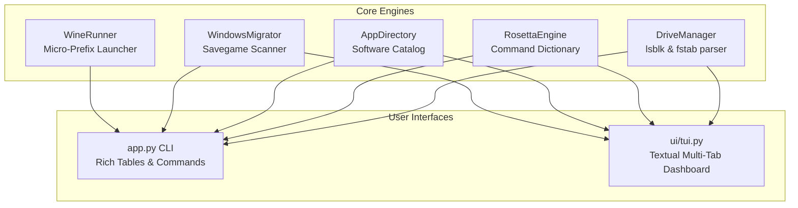

[🇩🇪 Zur deutschen Dokumentation wechseln](README_DE.md) | [🇬🇧 Switch to English Documentation](README.md)

<div align="center">

# 🪟 Cachy-WinBridge 🐧

**The Ultimate Windows-to-Linux Migration, Drive-Automount & Gaming Bridge for CachyOS / Arch Linux**

[](#)
[](README_DE.md)
[](#)
[](#)
[](LICENSE)
[](#)
[](#)

*Eliminate the #1 friction point for Windows switchers: Secondary drive automounting, Proton NTFS compatibility, command translations, native software equivalents, and savegame migration in one slick TUI & CLI tool.*

---

<p align="center">
  
</p>

</div>

---

## 💡 The Problem Cachy-WinBridge Solves

When users migrate from **Windows to Linux (especially CachyOS / Arch Linux)**, they face three frustrating hurdles:

1. **Invisible / Read-Only Secondary Drives**: Existing NTFS, Btrfs, or ext4 storage drives containing games or data are not automatically mounted upon boot, or fail in Steam Proton due to missing Windows file permission options (`uid=1000,gid=1000,windows_names,nofail`).
2. **Rosetta Stone Friction**: Muscle-memory Windows commands (`taskmgr`, `services.msc`, `devmgmt.msc`, `ipconfig`, `sfc /scannow`, `cls`, `dir`) don't work in bash/zsh, leaving switchers confused.
3. **Software & Savegame Hunting**: Users don't know the exact Linux replacements for tools like MSI Afterburner (MangoHud), 7-Zip (PeaZip/Ark), Equalizer APO (EasyEffects), and their game saves remain buried inside Windows user directories.

**Cachy-WinBridge bridges this gap effortlessly** — both for complete Linux beginners and experienced Arch/CachyOS power users who want rapid partition setup without manual fstab syntax headaches.

---

## ✨ Key Features

- 💾 **Drive & Gaming Automount Wizard**:
  - Automatically scans block devices (`lsblk -J`) across NTFS, Btrfs, and ext4.
  - 🛡️ **Pre-Flight Safety Check via `findmnt --verify`**: Simulates and validates new fstab additions in an isolated temp environment before touching `/etc/fstab`.
  - ⚠️ **NTFS Fast-Startup & Hibernation Advisor**: Identifies locked dirty-bit partitions caused by Windows Fast Startup and gives direct resolution commands.
  - Generates bulletproof, Steam/Proton-optimized `/etc/fstab` entries (`uid=1000,gid=1000,windows_names,nofail,x-gvfs-show`).
  - Automatic timestamped backups (`~/.config/cachy-winbridge/backups/`).
  - 1-Click user mounting via `udisksctl`.
- 📖 **Windows-to-Linux Rosetta Stone**:
  - Live interactive dictionary with 20+ core command translations (`taskmgr` ➔ `btop`, `services.msc` ➔ `systemctl`, `devmgmt.msc` ➔ `lspci`, `sfc /scannow` ➔ `pacman -Qk`).
  - Searchable by keyword or subsystem.
- 🛒 **Curated Software Catalog**:
  - Maps Windows software to native Linux equivalents (MangoHud, CPU-X, Heroic Games Launcher, EasyEffects, Kate, Ark, Ventoy, Vesktop).
  - Dynamically probes your system to show which tools are already installed, along with 1-click `pacman`/`yay` install commands.
- 🎮 **Windows Savegame & Steam Proton Compatdata Migrator**:
  - Scans installed Steam libraries (`libraryfolders.vdf` & `appmanifest_*.acf`) and maps Windows savegame directories directly to official **Steam AppIDs**.
  - 1-click migration straight into the Proton prefix (`compatdata/<APPID>/pfx/drive_c/users/steamuser/...`) with automated timestamped backup before overwrite.
- 🍷 **Isolated Micro-Prefix Launcher**:
  - Run standalone `.exe` and `.msi` installers inside sandboxed Wine prefixes without cluttering your system.
- 🖥️ **Dual Interface**:
  - Rich CLI with tables for fast scripting and status checks.
  - Modern Textual TUI dashboard with tabs and keyboard navigation.

---

## 🏗️ Architecture



---

## 🚀 Quick Start

### 1. Clone & Setup

```bash
git clone https://github.com/Graba92/cachy-winbridge.git
cd cachy-winbridge
chmod +x setup.sh run.sh app.py
./setup.sh
```

### 2. Launch Interactive TUI Dashboard

```bash
./run.sh tui
# or
python3 app.py tui
```

### 3. CLI Quick Commands

```bash
# Check drive mounts, fstab status, and installed software
python3 app.py status

# List all partitions and print Proton-safe /etc/fstab lines
python3 app.py drives --generate-fstab

# Mount all unmounted storage drives via udisksctl
python3 app.py mount-all

# Look up Windows commands
python3 app.py rosetta taskmgr
python3 app.py rosetta services

# Show recommended Linux software equivalents
python3 app.py apps

# Scan mounted Windows drives for game saves
python3 app.py migrator

# Launch a Windows .exe inside an isolated prefix
python3 app.py run-exe /path/to/installer.exe
```

---

## 📁 Repository Structure

```
cachy-winbridge/
├── app.py               # Main CLI & TUI entry point
├── core/
│   ├── apps.py          # Software catalog & live binary detector
│   ├── drives.py        # Block device scanner & fstab generator
│   ├── migrator.py      # Windows savegame & AppData scanner
│   ├── rosetta.py       # Windows-to-Linux Rosetta Stone engine
│   └── wine_runner.py   # Sandboxed Wine micro-prefix launcher
├── ui/
│   ├── console.py       # Rich CLI table formatters & banner
│   └── tui.py           # Full Textual tabbed TUI dashboard
├── preview_cli.png      # CLI showcase screenshot
├── requirements.txt     # Python dependencies (rich, textual)
├── setup.sh             # Dependency installer
├── run.sh               # Quick launcher script
├── LICENSE              # MIT License
├── README.md            # English documentation
└── README_DE.md         # German documentation
```

---

## 🛡️ License

This project is licensed under the [MIT License](LICENSE) — Copyright (c) 2026 Graba92.
