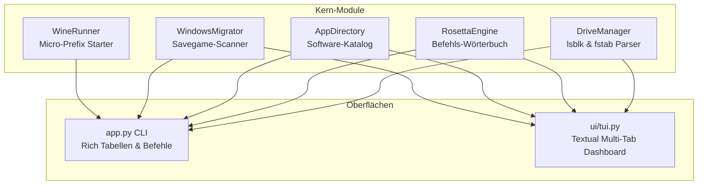

[🇩🇪 Zur deutschen Dokumentation wechseln](README_DE.md) | [🇬🇧 Switch to English Documentation](README.md)

<div align="center">

# 🪟 Cachy-WinBridge 🐧

**Die ultimative Windows-zu-Linux Migrations-, Automount- & Gaming-Bridge für CachyOS / Arch Linux**

[](README.md)
[](#)
[](#)
[](#)
[](LICENSE)
[](#)
[](#)

*Löst den #1 Frustfaktor beim Umstieg von Windows auf Linux: Automatisches Einhängen von Zweitfestplatten, Steam Proton NTFS-Kompatibilität, Befehls-Übersetzer, Software-Alternativen und Spielstand-Migration in einem schicken TUI & CLI Tool.*

---

<p align="center">
  
</p>

</div>

---

## 💡 Welches Problem löst Cachy-WinBridge?

Wer von **Windows auf Linux (speziell CachyOS oder Arch Linux)** umsteigt, stößt sofort auf typische Hürden:

1. **Nicht gemountete oder schreibgeschützte Gaming-Platten**: Bestehende NTFS-, Btrfs- oder ext4-Laufwerke mit Spielen oder Daten werden beim Systemstart nicht automatisch eingebunden oder führen in Steam Proton zu Abstürzen wegen fehlender Windows-Rechte (`uid=1000,gid=1000,windows_names,nofail`).
2. **Rosetta Stone Hürde**: Gewohnte Windows-Befehle (`taskmgr`, `services.msc`, `devmgmt.msc`, `ipconfig`, `sfc /scannow`, `cls`, `dir`) funktionieren im Linux-Terminal nicht, was Umsteiger frustriert.
3. **Software-Suche & verlorene Spielstände**: Umsteiger wissen oft nicht, welche Linux-Alternativen für Programme wie MSI Afterburner (MangoHud), 7-Zip (PeaZip/Ark) oder Equalizer APO (EasyEffects) existieren – und alte Spielstände schlummern unentdeckt auf der Windows-Partition.

**Cachy-WinBridge schließt diese Lücke nahtlos** — sowohl für absolute Linux-Neulinge als auch für erfahrene Arch/CachyOS-Poweruser, die Laufwerke ohne manuelle fstab-Fehler einrichten möchten.

---

## ✨ Hauptfunktionen

- 💾 **Laufwerk- & Gaming-Automount Wizard**:
  - Scannt Blockgeräte via `lsblk -J` über NTFS, Btrfs und ext4.
  - Generiert Steam/Proton-optimierte `/etc/fstab` Einträge mit sicheren Optionen (`uid=1000,gid=1000,windows_names,nofail,x-gvfs-show`).
  - Erstellt automatisch zeitgestempelte Backups der aktuellen `/etc/fstab`.
  - 1-Klick-Mount ohne Root-Passwort via `udisksctl`.
- 📖 **Windows-zu-Linux Rosetta Stone**:
  - Interaktives Nachschlagewerk mit über 20 Kernbefehlen und Konzepten (`taskmgr` ➔ `btop`, `services.msc` ➔ `systemctl`, `devmgmt.msc` ➔ `lspci`, `sfc /scannow` ➔ `pacman -Qk`).
  - Such- und filterbar nach Begriffen oder Kategorien.
- 🛒 **Kuratierter Software-Katalog**:
  - Zeigt Umsteigern die idealen Linux-Pendants zu bekannten Windows-Tools (MangoHud, CPU-X, Heroic Games Launcher, EasyEffects, Kate, Ark, Ventoy, Vesktop).
  - Erkennt live, welche Programme bereits auf dem System installiert sind, inklusive fertiger `pacman`/`yay` Installationsbefehle.
- 🎮 **Windows Spielstand- & AppData-Migrator**:
  - Durchsucht gemountete Windows-Laufwerke nach Benutzerordnern wie `Saved Games`, `Documents/My Games`, `AppData/Local` und `AppData/Roaming`.
  - 1-Klick-Übernahme direkt in das persönliche Linux-Home-Verzeichnis.
- 🍷 **Isolierter Micro-Prefix Launcher**:
  - Startet einzelne `.exe` und `.msi` Dateien in isolierten, sauberen Wine-Prefixen, ohne das System zu vermüllen.
- 🖥️ **Zwei Bedienoberflächen**:
  - Rich CLI mit übersichtlichen Tabellen für schnelle Terminal-Befehle und Skripte.
  - Vollwertiges, interaktives Textual TUI-Dashboard mit Tabs und Tastatursteuerung.

---

## 🏗️ Architektur



---

## 🚀 Schnellstart

### 1. Klonen & Einrichten

```bash
git clone https://github.com/Graba92/cachy-winbridge.git
cd cachy-winbridge
chmod +x setup.sh run.sh app.py
./setup.sh
```

### 2. Interaktives TUI-Dashboard starten

```bash
./run.sh tui
# oder
python3 app.py tui
```

### 3. CLI Schnellbefehle

```bash
# Status der Laufwerke, fstab und Software prüfen
python3 app.py status

# Alle Partitionen auflisten und Proton-optimierte fstab-Zeilen anzeigen
python3 app.py drives --generate-fstab

# Alle ungemounteten Partitionen sofort via udisksctl einhängen
python3 app.py mount-all

# Windows-Befehle nachschlagen
python3 app.py rosetta taskmgr
python3 app.py rosetta services

# Software-Katalog und Installationsstatus anzeigen
python3 app.py apps

# Windows-Festplatten nach alten Spielständen scannen
python3 app.py migrator

# Eine Windows-Datei im isolierten Prefix ausführen
python3 app.py run-exe /pfad/zum/programm.exe
```

---

## 📁 Projektstruktur

```
cachy-winbridge/
├── app.py               # Zentraler CLI- & TUI-Einstiegspunkt
├── core/
│   ├── apps.py          # Software-Katalog & Live-Erkennung
│   ├── drives.py        # Blockgeräte-Scanner & fstab-Generator
│   ├── migrator.py      # Spielstand- & AppData-Scanner
│   ├── rosetta.py       # Windows-zu-Linux Übersetzungslogik
│   └── wine_runner.py   # Isolierter Wine-Prefix Launcher
├── ui/
│   ├── console.py       # Rich CLI Tabellen & Banner
│   └── tui.py           # Textual TUI Dashboard mit Tabs
├── preview_cli.png      # Vorschau-Screenshot für GitHub
├── requirements.txt     # Python-Abhängigkeiten (rich, textual)
├── setup.sh             # Installations-Skript
├── run.sh               # Schnellstart-Skript
├── LICENSE              # MIT-Lizenz
├── README.md            # Englische Dokumentation
└── README_DE.md         # Deutsche Dokumentation
```

---

## 🛡️ Lizenz

Dieses Projekt ist lizenziert unter der [MIT-Lizenz](LICENSE) — Copyright (c) 2026 Graba92.
